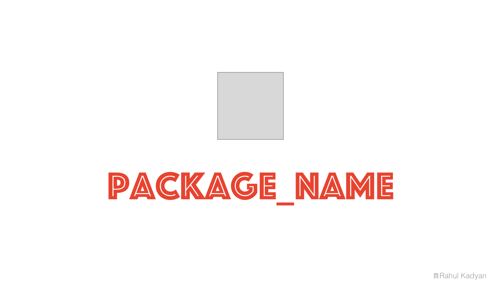

# attach

This is where your description should go. Try and limit it to a paragraph or two, and maybe throw in a mention of what
PSRs you support to avoid any confusion with users and contributors.



<p align="center">
  <a href="https://styleci.io/repos/59930684">
    
  </a>
  <a href="https://circleci.com/gh/znck/attach">
    
  </a>
  <a href="https://coveralls.io/github/znck/attach?branch=master">
    
  </a>
  <a href="LICENSE">
    
  </a>
  <a href="https://packagist.org/packages/znck/attach">
    
  </a>
  <a href="https://github.com/znck/attach/releases">
    
  </a>

  <a href="https://github.com/znck/attach/issues">
    
  </a>
</p>

> Milestones
> - [ ] File uploads.
> - [ ] Attach files to eloquent models.
> - [ ] Delete/Update files.
> - [ ] File preview and/or thumbnail.
> - [ ] File routing.
> - [ ] Signed URL.

## Install

Via Composer

``` bash
$ composer require znck/attach
```

## Usage

> TODO: Add usage docs.

## Change log

Please see [CHANGELOG](CHANGELOG.md) for more information what has changed recently.

## Testing

``` bash
$ composer test
```

## Contributing

Please see [CONTRIBUTING](CONTRIBUTING.md) and [CONDUCT](CONDUCT.md) for details.

## Security

If you discover any security related issues, please email hi@znck.me instead of using the issue tracker.

## Credits

- [Rahul Kadyan][link-author]
- [All Contributors][link-contributors]

## License

The MIT License (MIT). Please see [License File](LICENSE.md) for more information.

[link-author]: https://github.com/znck
[link-contributors]: ../../contributors
