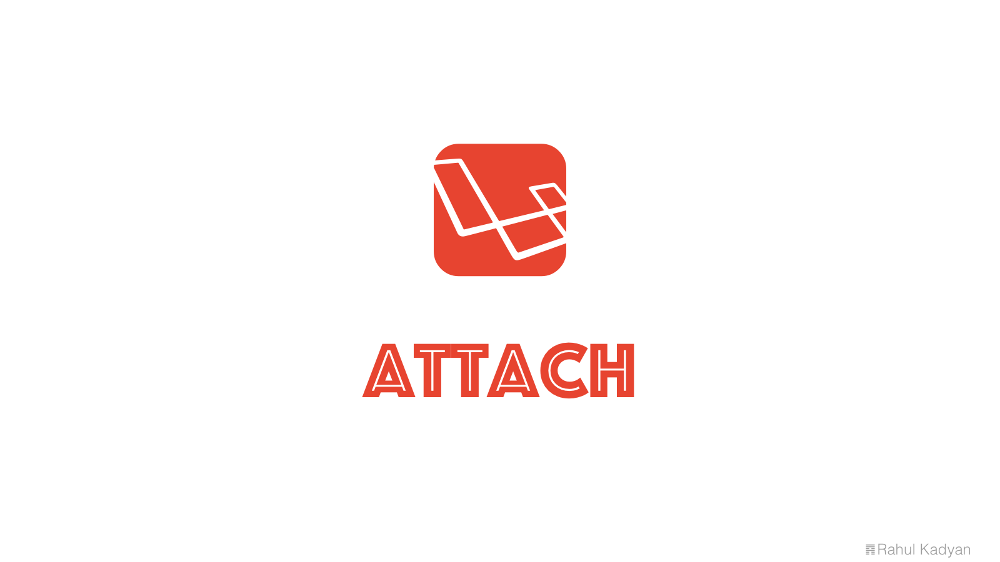

# Attach

A fluent way to manage media attachments for Laravel. See [docs](http://znck.me/attach) for install, usage and change log.

  
  
  
  
  
  

  

## Contributing

Please see [CONTRIBUTING](CONTRIBUTING.md) and [CONDUCT](CONDUCT.md) for details.

## Security

If you discover any security related issues, please email hi@znck.me instead of using the issue tracker.

## Credits

- [Rahul Kadyan][link-author]
- [All Contributors][link-contributors]

## License

The MIT License (MIT). Please see [License File](LICENSE.md) for more information.

[link-author]: https://github.com/znck
[link-contributors]: ../../contributors
